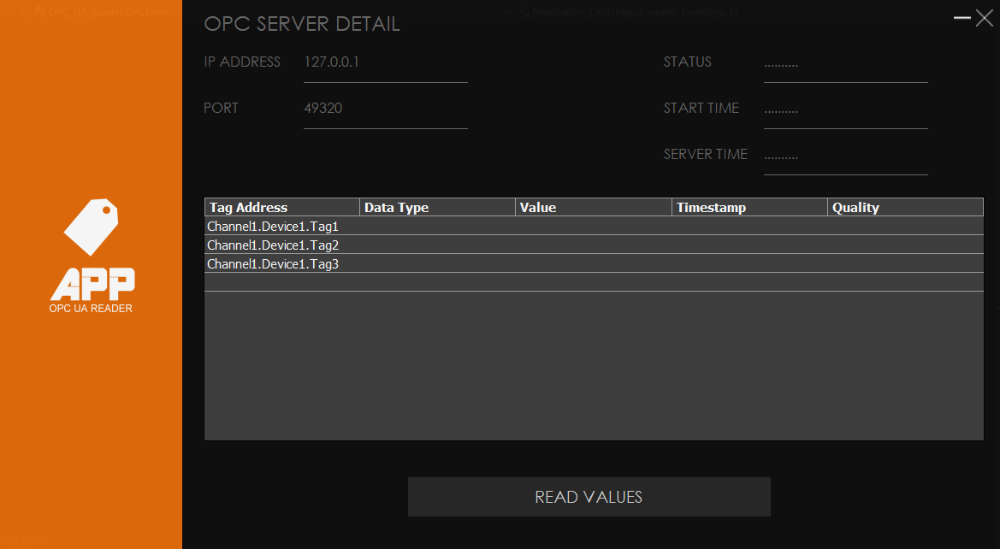
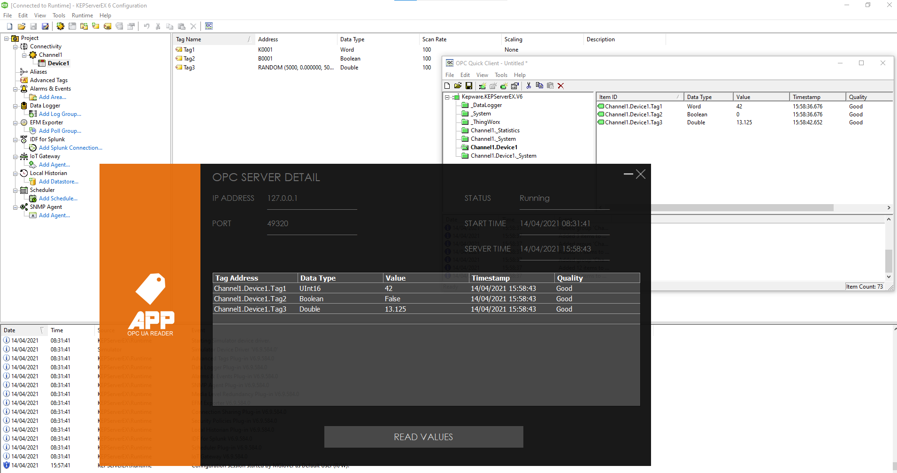

# OPC-UA-READER

Application that demonstrates reading OPC Tags from an OPC Server using C#.

Tech blog articles:
[Reading OPC UA Tags with a C# Application (Part 1: KEPServerEX 6 Configuration)](http://techblog.appliedprojectsengineering.com/post/2021/04/15/reading-opc-ua-tags-with-a-c-application-part-1-kepserverex-6-configuration)
[Reading OPC UA Tags with a C# Application (Part 2: Creating the C# application)](http://techblog.appliedprojectsengineering.com/post/2021/04/15/reading-opc-ua-tags-with-a-c-application-part-2-creating-the-c-application)

